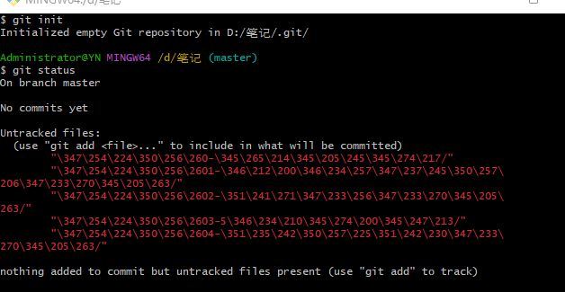
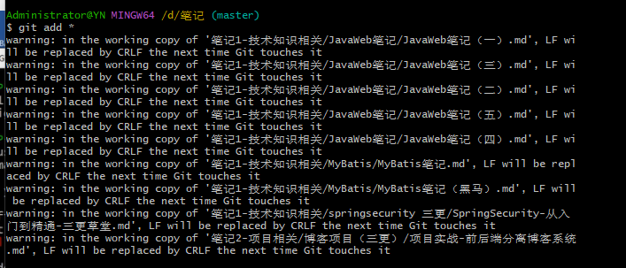
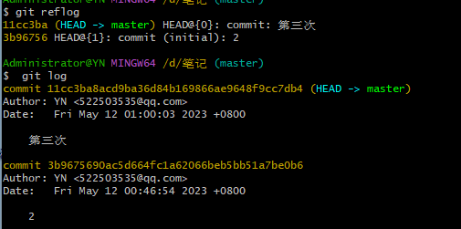

[TOC]


### 1.设置用户签名

git config命令的–global参数，用了这个参数，表示你这台机器上所有的Git仓库都会使用这个配置，当然也可以对某个仓库指定不同的用户名和Email地址。
#### 1.查看git配置信息
$ git config --list

#### 2.查看git用户名、密码、邮箱的配置
$ git config user.name
$ git config user.password
$ git config user.email

#### 3.设置git用户名、密码、邮箱的配置
$ git config user.name “freedom”
$ git config user.password “123456”
$ git config user.email “1548429568@qq.com”

#### 4.设置git用户名、密码、邮箱的配置（全局配置）
$ git config --global user.name 用户命
$ git config --global user.name freedom
$ git config --global user.password 密码
$ git config --global user.password abc0506abc
$ git config --global user.email 邮箱
$ git config --global user.email “1548429568@qq.com”

##### 5.修改git用户名、密码、邮箱的配置（跟设置语法一样，没有用户名就添加，有了用户名就修改）
$ git config user.name “freedom”

4.修改git用户名、密码、邮箱的配置（全局配置）
$ git config --global user.name “freedom”
------------------------------------------------


### 2.初始化本地库  git init

1.进入你要进行版本控制的文件目录

2.初始化操作命令

```c
git init
```


#### 查看本地库状态  git status

```
git status
```



红色的是还没有被追踪的文件‘《工作区》

#### 添加暂存区  git add 

命令

```
git add 
```

可以指定文件名字

也可以用*代表所有的

亦可以用 --all



不用管warning

#### 将暂存区的文件移除命令 git rm --cached

```
git rm --cached 文件名
```


#### 提交本地库 git commit

```
git commit -m "版本信息"
```


#### 查看版本信息 git log

```
git reflog 
```


3b96756 是版本号(精简的)

指向的是master这个分支的

```
git log .//查看具体的信息
```


####  版本穿梭  git reset --hard

```\
git reset --hard 版本号
```


首先 查看版本号，用精简的版本号或者是完整的版本号都可以




底层是移动的HEAD指针

