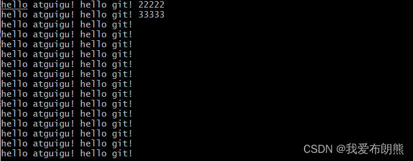
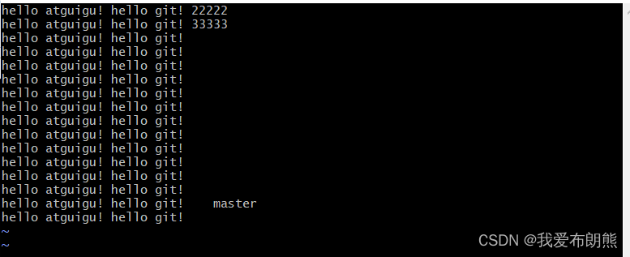
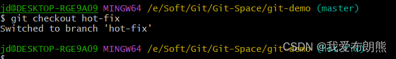
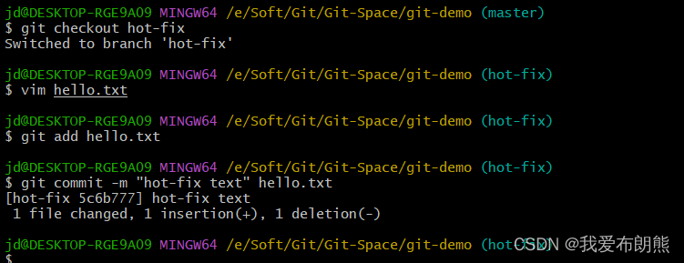

1.1 服务器运行模式
------------

   从右向左看

   用户在生产分支上进行使用，程序员在开发分支上进行开发


1.2  分支概念
---------

   在版本控制过程中，同时推进多个任务，我们就可以创建每个任务单独的分支。使用分支意味着程序员可以把自己的工作从开发主线上分离开，开发自己分支的时候，不会影响主线分支的运行，对初学者来说，分支可以简单的理解为副本，一个分支就是一个单独的副本**（分支底层其实也是指针的引用）**

比如下图来说，

    在master这个主线上运行，运行的同时要增加功能，那我们就可以把master赋值一份出来，在复制的地方进行开发，在开发完功能后就可以更新版本正常使用
    
    当我们引入新功能有bug，就可以从master分支再引一个分支hot-fix(热修分支)，对代码进行修改，修改后再合并到master


 1.3 分支的好处
----------

 同时并行推进多个功能开发，提高效率

  各个分支在开发过程中，如果一个分支开发失败，不会对其他分支有任何影响。失败的分支删除重新开始即可。

 2.1 分支操作
---------


**2.2 查看当前分支**
--------------

```null
git branch -v

```

目前我们只有一个分支


2.3 创建分支
--------

```null
git branch 分支名
```


再次查看分支，发现确实多了一个


2.4 切换分支
--------

### 2.4.1 切换分支

 我们可以看一下下图最后一行末尾的蓝字还是“master”，说明还是在master分支上面的


```null
git checkout  分支名
```


 我们发现git后面的显示确实是从“master”变成了“hot-fix”

我们再查看一下分支，也确实改变了


### 2.4.2  修改代码并提交（完整过程）


  修改成下面的代码



**我们可以查一下本地库状态**

 

**添加到本地库**


**提交到本地库**


**再次查看文件**


**查看提交版本**


  先将分支切换为master分支然后再合并


然后我们查看一下代码，依然是原来的模样，因为当前指针又回来了，我们也没有合并


**下面演示也下合并**

**命令：** 

```null
git merge 分支名
```

**把指定的分支合并到当前分支上**

  3.1 正常合并
----------

下面这段代码的含义就是将**“hot-fix”分支合并到“master”分支上**


**合并成功，一个文件被修改，两个删除，两行增加**

**查看代码**


**上面是正常的合并**

  3.2 冲突合并（企业常见）
----------------

  产生原因：合并分支时，两个分支在**同一个文件的同一个位置有两套完全不同的修改**，Git无法替我们决定使用哪一个，必需人为决定新代码内容

### **3.2.1 演示冲突情况（错误情况）：** 

    **先修改一下master分支**



**添加暂存区、提交本地库**


**再修改一下hot-fix分支**






**切换回master开始操作**


**合并**

**类似下面的这种提示**

**查看本地库状态**


就告诉我们了，hello.txt是没有合并成功的，两个分支都对他做了修改了

**此时就不能自动合并了，就需要我们手动合并代码**  


###  3.2.2 手动修改

**此时我们手动打开文件看一下，冲突的地方已经给我们标出来了**

**通过<<<<<   =====  >>>>\> 这种特殊符号标记出来冲突**

**<<<****HEAD 表示当前分支**

**在HEAD与====之间是当前分支的代码**

**在====与>>>>之间是我们要合并的代码**

**明显这两部分都做了修改，所以Git蒙蔽了**


**如何手动合并？**

   **想要把保存的留下来就可以了，手动删，把特殊符号也删掉，记得保存**


此时我们应该把我们**修改之后的文件放到暂存区、提交本地库（这个时候提交不能带文件名）**


**完美查看文件**


###    3.2.3 底层仍是指针

