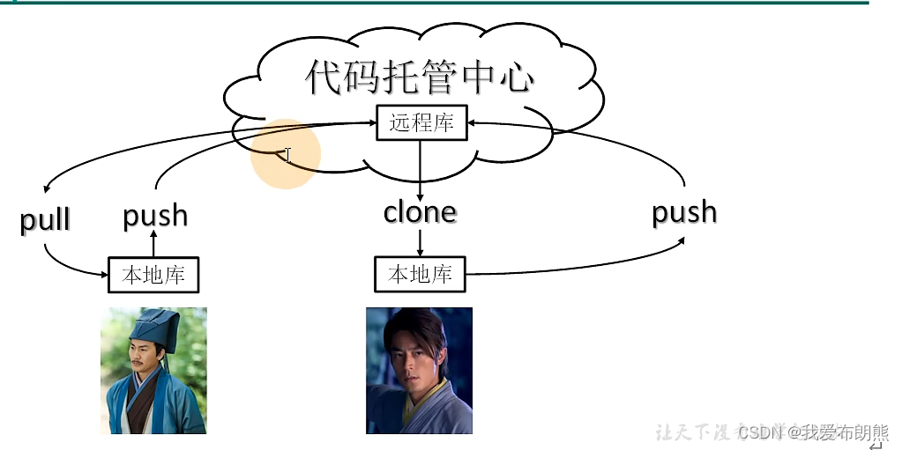
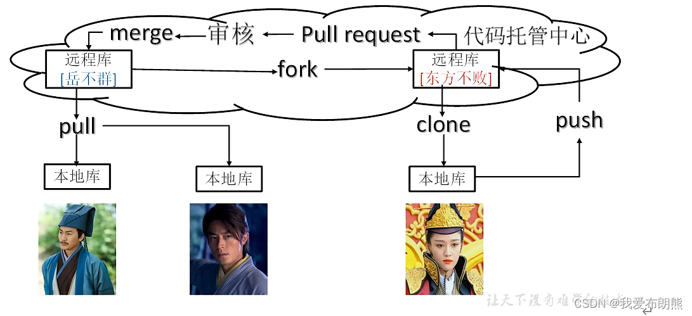

   说明：

       岳不群研究了一套剑法，先用Git初始了一下本地库，写了一套剑法。为了让大弟子令狐冲可以学习，岳不群便把剑法push（推送）到代码托管中心（远程库）；
    
        令狐冲便可以把剑法从远程库中克隆（完成复制）下来，复制到自己的本地库中，然后便可以修改修改，然后把修改后的剑法再push到远程库中（但是前提是岳不群得把令狐冲加到自己的团队中才可以）
    
       在令狐冲将修改后的剑法push到远程库时，岳不群便可以pull（拉取）令狐冲修改后的剑法，一旦岳不群pull之后，便会更新自己的本地库代码（本地剑法更新一版）
    
       这时岳不群、代码托管中心、本地库三者一致

 说明：

    在剑法得到岳不群和令狐冲的改善后还不完美，令狐冲又找到了自己的好朋友东方不败，希望东方不败提点建议

   但是东方不败不会加入到岳不群的团队中，那这怎么办呢？

    东方不败从岳不群的远程库（代码托管中心）中fork（叉）一份到自己的远程库中，这样一来东方不败就有自己的远程库了，东方不败就可以从自己的远程库clone一份到本地库，便可以在本地库中做出修改

   当东方不败改好后，先把剑法push到自己的远程库中，然后再向岳不群发起 Pull request（拉取请求）请求，经过岳不群的审核之后便可merge合并，岳不群就可pull到自己的本地库开始修炼