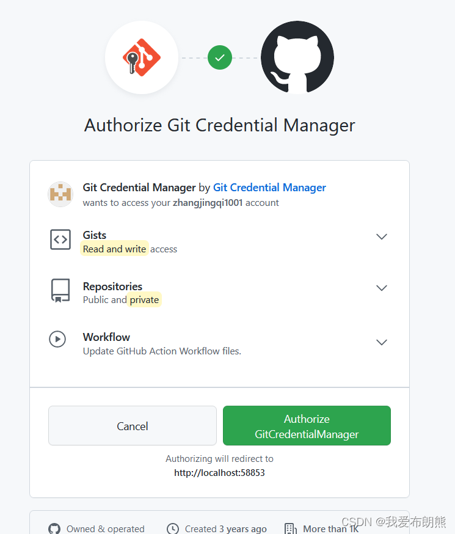
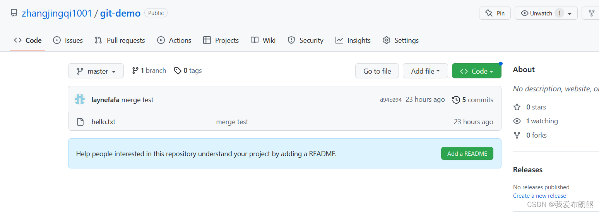
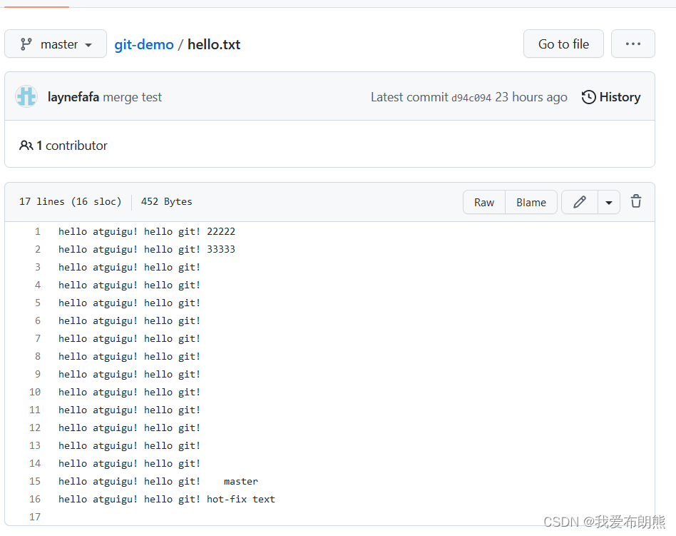
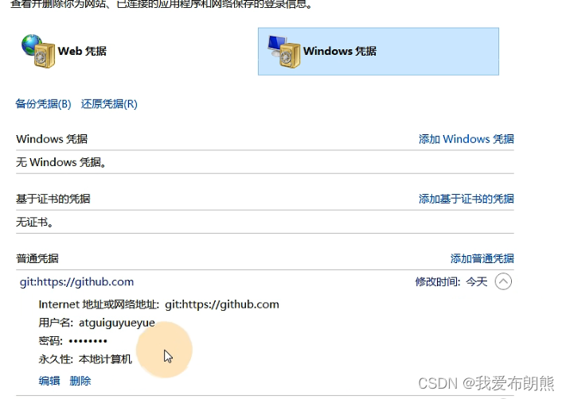
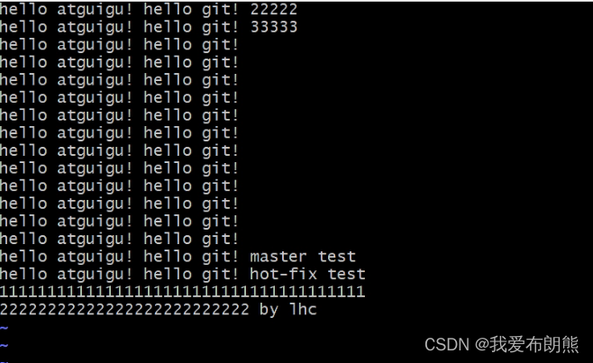
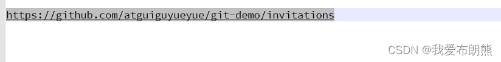
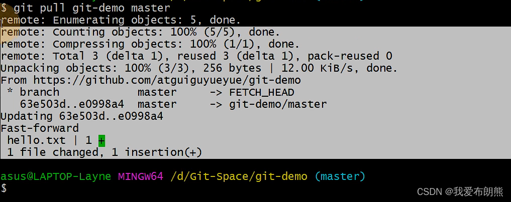
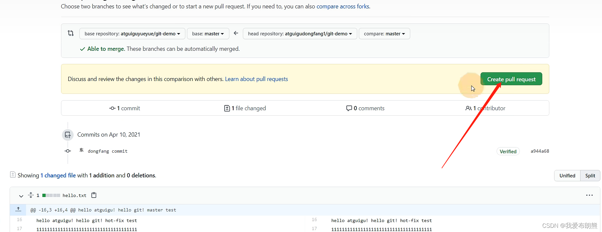

> **网址:**[GitHub: Let’s build from here · GitHub](https://github.com/ "GitHub: Let’s build from here · GitHub")

**目录**

[一、创建远程仓库](#t0)

[二、远程库操作](#t1)

[ 2.1  查看远程库别名](#t2)

[ 2.2 创建远程仓库别名](#t3)

[ 2.3 推送本地分支到远程仓库](#t4)

[ 2.4  拉取远程库到本地库](#t5)

[ 2.5 克隆远程库到本地](#t6)

[三、 跨团队协作](#t7)

[ 3.1 团队内协作](#t8)

[ 3.2  跨团队协作](#t9)

[四、SSH免密码登录](#t10)

* * *

成功登录GitHub之后，点击右上角头像旁边的“+”号，再点击“New Repository”


 点击之后，我们可以**设置远程库的名字，一般和本地库的名字相同**

  这个地方是不用担心重名的，因为在远程库名称以前还有一个用户名，用户名就是唯一的


**选择远程库分类**

   一个公共库，一个远程库，我们选择一个公共库就可以了，所有的小伙伴都可以拉去我们的代码。

     私有库是收费的


**初始化信息不用管，直接点击绿色按钮**

**然后就会出现下面的页面**


 **这个地方有HTTP协议，有一个SSH协议，我们选择的是HTTP协议**


   2.1  查看远程库别名
---------------

```null
mote -v
```

**目前还是没有别名的**


  2.2 创建远程仓库别名
--------------

```null
 git remote add git-demo https://github.com/zhangjingqi1001/git-demo.git

```


**再次查看别名    就可以查看到别名**

**为什么两个？  因为这个既可以拉去，也可以推送，所以出现了两个**


 2.3 推送本地分支到远程仓库
----------------

```null
git push 别名 分支
```


**然后弹出小框，点击这个蓝色的“用浏览器登录”**

 

**然后弹出下面的页面 ，点击下面大大的绿色**



**出现下图页面之后表示登录成功**


**而且此时也会有提示，并且显示remote ....100%.....**


**点开我们刚刚创建项目的页面，刷新下面的页面**


**我们发现本地库的代码成功的登录了**



**点击文件也可查看文件的内容**



**点击这个笔还可以当场修改代码**

 

  2.4  拉取远程库到本地库
----------------

**首先我们先在GitHub对文件进行修改**


**然后提交本次改变**


**此时内容已经改变了，下面我们把远程库拉去过来**

**命令**

```null
git pull 别名 分支
```


**其中也提示一个文件被修改了，一行删除，一行增加**

 

**我们可以查看一下本地库状态，一看很干净，说明拉取这个动作就会帮我们提交本地库**


**查看文件**


**此时就保证了本地库和远程库代码一致**

 2.5 克隆远程库到本地
-------------

**创建一个新的文件模拟令狐冲**


**毫无疑问你得打开令狐冲的客户端**


**命令：** 

```null
git clone 师傅的链接
```

**师傅的链接在下图复制**


**在下面做测试的时候，如果是在一个人的Windows在做，记得打开凭据管理器删除我们之前的凭据**



**运行这段代码**


**克隆代码是不需要登录账号的，因为我们当时建库的时候是public，任何人都可以**

**克隆成功！！！**

**克隆完成了三件事：1.拉去代码  2.初始化本地库  3.创建别名**

 

**查看别名（自动取了一个名叫origin）**

 

> [Git——团队内协作和跨团队协作_我爱布朗熊的博客-CSDN博客](https://blog.csdn.net/weixin_51351637/article/details/127989796?spm=1001.2014.3001.5501 "Git——团队内协作和跨团队协作_我爱布朗熊的博客-CSDN博客")
>
> **具体详细理论在上面这篇博客中**

 3.1 团队内协作
----------

    **如今我们在令狐冲的界面操作剑法**（为什么这样可以参考上面的博客，真的很生动形象）



**但是我们修改之后应该添加暂存区，提交本地库**


**把代码push到远程库**

**我们在push的时候，这个地方不采用别名了，可以写上项目的链接**


**依然是弹出下面的小框 ，我们不能再点击“浏览器登录”，因为我们浏览器登录的是岳不群的账号，而现在是令狐冲**

**可以选择浏览器登录，前提是把岳不群的账号退掉，登录上令狐冲的账号**

 

**点击绿色按钮**

**出现下图表示登录成功**

**但是！！！！我们看一下控制台，有一个错误**

**令狐冲无法推送的远程代码库**

**原因是我们知道令狐冲是岳不群的大弟子，而Git不知道，我们要让Git知道**


**怎么加入团队？**

    **登录上岳不群的账号，邀请令狐冲**
    
    首先进到hello.txt的库，然后点击Setting


**首先点击左侧的Manage Access，再点击右侧的绿色按钮**


**在框内输入账号，再点击绿色按钮**

 

**下一步就是出现这个页面，我们应该点击箭头指向的一个邀请函，得把邀请函复制下来**


 **邀请函也是一个地址，然后把这个地址通过微信等方式发送给令狐冲**

**然后令狐冲登录上自己的GitHub账号，复制邀请函到地址栏，然后就可以看到岳不群的邀请函，绿色的就是加入，白色的就是婉拒**


**当同意了之后，我们就能在令狐冲的这里看到岳不群的剑法了**


**此时我们就可以进行代码的推送了 ，完美完成   岳不群也能看到修改后的剑法了**


**当令狐冲修改完剑法并上传到远程代码库，岳不群便可以拉取**

  如果是自己完成的话，记得删除令狐冲的凭据再自己演示，如果是小伙伴们好几个演示的话就不用

   因为这个项目在岳不群这里有别名，我们可以使用别名拉取



 

 3.2  跨团队协作
-----------

 将远程库的地址赋值发给邀请跨团队协作的人，比如东方不败

 我们可以登录上东方不败的账号

 我们依然是通过微信等方式将https://github.com/zhangjingqi1001/git-demo.git链接发送给东方不败

我们在**右上角的搜索框中输入链接，便可以进入到代码库，也能看**


**我们需要点一下右上角的Fork，然后叉到我们的本地来**


**然后东方不败这里也有了一个git-demo**


 东方不败可以选择在线编辑，也可以选择我们之前的方式克隆一份到本地库，然后再加上之后的一顿操作

我们下面试试在线编辑，修改代码 。在提交之后，只是在东方不败（的远程代码库）这里完成了修改岳不群那还有没有完成修改


**东方不败可以点击Pull request （拉取请求）**


 

 

**然后我们再从岳不群的地方查看**

岳不群的Pull request地方有提示，我们点开就可以了


**在检查以及沟通完成后，我们可以合并代码“Merge pull request” ,合并好之后，我们的代码就修改了，同样令狐冲的远程代码库也修改了**


 远程仓库中还有一个SSH的地址，因此我们也可以使用SSH进行访问，但是下面显示没有任何公共的SSH的Key，用不了这个链接


**怎么添加？？？**

**首先在下面这个目录打开Git客户端**


输入第一行的命令连续敲三次回车


我们的目录中就多了.ssh


**公钥，进入.ssh文件夹查看文件，复制公钥**


登录上岳不群的账号，在岳不群头像下面有一个setting，单击


**出现下面这样子便成功了**


**使用岳不群实验：** 


 