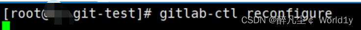

**目录**

[前言](#t0)

[一、gitlab 介绍](#t1)

[二、git和svn 的区别](#t2)

[1、 集中式vs分布式](#t3)

[2、 版本库与工作区](#t4)

[3\. 全局版本号和全球版本号](#t5)

[4、部分检出和全局检出](#t6)

[5、更新和提交](#t7)

[三、Git和svn的优缺点比较](#t8)

[1、SVN优缺点](#t9)

[2、Git优缺点](#t10)

[四、git、gitlab、GitHub的简单区别](#t11)

[五、Gitlab 搭建](#t12)

[1、gitlab 安装](#t13)

[方法一、设置gitlab的yum源（使用清华镜像源安装GitLab）](#t14)

[方法二、脚本安装gitlab](#t15)

[ 方法三、清华开源软件rpm下载](#t16)

[六、gitlab安装目录 ](#t17)

[七、GitLab常用命令汇总](#t18)

[八、Gitlab访问测试](#t19)

[1、Gitlab登录](#t20)

[ 2、配置默认访问密码](#t21)

[3、想要登录自己创建的用户？](#t22)

[九、Gitlab 图形化界面操作 ](#t23)

[1、Gitlab关闭自动注册](#t24)

[2、Gitlab登录免密认证 ](#t25)

[3、Gitlab创建项目 ](#t26)

[4、使用管理员创建用户 ](#t27)

[5、Gitlab 添加邮箱设置](#t28)

[5.1、开启smtp功能](#t29)

[ 5.2、验证](#t30)

[6、修改登录欢迎页面 ](#t31)

[十、Gitlab命令行操作 ](#t32)

[编辑1、命令行新建分支 ](#t33)

[2、上传代码到仓库](#t34)

[3、Git 命令行常用指令的使用 ](#t35)

[3.1、提交与修改操作](#t36)

[十一、项目创建（测试）](#t37)

[1、GitLab权限](#t38)

[1.1、访问权限](#t39)

[1.2、GitLab分支角色管理](#t40)

[1.3、工程权限](#t41)

[1.4、组权限](#t42)

[2、设置用户权限 ](#t43)

[3、数据流向图](#t44)

[十二、Gitlab 数据备份 ](#t45)

[ 1、Gitlab 创建备份](#t46)

[1.1、手动备份](#t47)

[2、更改Gitlab备份目录](#t48)

[3、Gitlab自动备份](#t49)

[定时自动备份](#t50)

[3.1、方法一、输入: crontab -e 然后添加相应的任务](#t51)

[3.2、脚本执行gitlab 备份 ](#t52)

[十三、Gitlab-CI/CD ](#t53)

[CICD是什么?](#t54)

[持续集成的好处是什么？](#t55)

[持续交付的好处是什么？](#t56)

[持续部署的好处是什么？](#t57)

[十四、总结](#t58)

* * *

公司代码的管理不统一，一部分人用[SVN](https://so.csdn.net/so/search?q=SVN&spm=1001.2101.3001.7020)，一部分人用Git，对于习惯了使用Linux或者Mac命令行的人来说，Git的操作更方便和快捷，和小伙伴商量了一下把整个代码管理工具切换成了Git，GitHub如果不是开源项目的话是需要付费使用，所以选择使用GitLab。


**Gitlab是一个用于仓库管理系统的开源项目**，使用Git作为代码管理工具，并在此基础上搭建起来的web服务。[Gitlab](https://so.csdn.net/so/search?q=Gitlab&spm=1001.2101.3001.7020)有乌克兰程序员DmitriyZaporozhets和ValerySizov开发，它由Ruby写成。后来，一些部分用Go语言重写，现今并在国内外大中型互联网公司广泛使用。gitlab-ce是它的社区版，gitlab-ee是企业版，是收费的。

****Git****: 是一个开源的分布式版本控制系统，用于敏捷高效地处理任何或小或大的项目。Git 是 Linus Torvalds 为了帮助管理 Linux 内核开发而开发的一个开放源码的版本控制软件。

**下图就是分布式版本控制工具管理方式：** 


**Git：** 是分布式版本控制系统，它没有中央服务器，每个人的电脑就是一个完整的版本库，这样工作的时候就不需要联网了，因为版本都是在自己的电脑上。既然每个人的电脑都有一个完整的版本库，那多个人如何协作呢？比如说自己在电脑上改了文件A，其他人也在电脑上改了文件A，这时，你们两之间只需把各自的修改推送给对方，就可以互相看到对方的修改了。

****SVN****: 是一个开放源代码的版本控制系统，通过采用分支管理系统的高效管理，简而言之就是用于多个人共同开发同一个项目，实现共享资源，实现最终集中式的管理。集中管理方式在一定程度上看到其他开发人员在干什么，而管理员也可以很轻松掌握每个人的开发权限。

****下图就是标准的集中式版本控制工具管理方式：****


但是相较于其优点而言，集中式版本控制工具缺点很明显：

服务器单点故障

容错性差

****Git 的内容完整性要优于svn：****

****GIT的内容存储使用的是SHA-1哈希算法。这能确保代码内容的完整性，确保在遇到磁盘故障和网络问题时降低对版本库的破坏。****

一个研发队伍的成员正常包括：需求分析、设计、美工、程序员、测试、实施、运维，每个成员在工作中都有产出物， 包括了文档、设计代码、程序代码，这些都需要按项目集中进行管理的。SVN能清楚的按目录进行分类管理， 使项目组的管理处于有序高效的状态，SVN更适用于项目管理， Git更适用于代码管理。

****1********、********集中式vs分布式****
----------------------------------

Subversion（svn）属于集中式的版本控制系统

Git属于分布式的版本控制系统

****2、 版本库与工作区****
------------------

SVN的版本库和工作区是分离的

Git 的版本库和工作区如影随形

****3\. 全局版本号和全球版本号****
-----------------------

SVN的全局版本号和CVS的每个文件都独立维护一套版本号相比，是一个非常大的进步。在看似简单的全局版本号的背后，是Subversion提供对于事物处理的支持，每一个事物处理（即一次提交）都具有整个版本库全局唯一的版本号。

Git的版本号则更进一步，版本号是全球唯一的。Git 对于每一次提交，通过对文件的内容或目录的结构计算出一个SHA-1 哈希值，得到一个40位的十六进制字符串，Git将此字符串作为版本号 

****4、********部分检出和全局检出****
---------------------------

Subversion可以将整个库检出到工作区，也可以将某个目录检出到工作区。对于要使用一个庞大、臃肿的版本库的用户来说，部分检出是非常方便和实际的。  
Git只能全部检出，不支持按照目录进行的部分检出。

****5、********更新和提交****
-----------------------

在SVN中，因为只有一个中心仓库，所以所谓的远程更新，也就是svn update ,通过此命令来使工作区和版本库保持同步。如果不能连接到服务器上，基本上不可以工作。

对于git来说，别人的改动是存在于远程仓库上的，所以git checkout命令尽管在某些功能上和svn中的update类似（例如取仓库特定版本的内容），但是在远程更新这一点上，还是不同的，不属于git checkout的功能涵盖范围。 Git使用git fetch和git pull来完成远程更新任务，fetch操作只是将远程数据库的object拷贝到本地，然后更新remotes head的refs，git pull 的操作则是在git fetch的基础上对当前分支外加merge操作。可离线工作。

****1、SVN优缺点****
----------------

****优点：****

1、 管理方便，逻辑明确，符合一般人思维习惯。

2、 易于管理，集中式服务器更能保证安全性。

3、 代码一致性非常高。

4、 适合开发人数不多的项目开发。

**缺点：** 

1、 服务器压力太大，数据库容量暴增。

2、 如果不能连接到服务器上，基本上不可以工作，如果服务器不能连接上，就不能提交，还原，对比等等。

3、 不适合开源开发（开发人数非常非常多，但是Google app engine就是用svn的）。但是一般集中式管理的有非常明确的权限管理机制（例如分支访问限制），可以实现分层管理，从而很好的解决开发人数众多的问题。

****2、Git优缺点****
----------------

**优点：** 

1、适合分布式开发，强调个体。

2、公共服务器压力和数据量都不会太大。

3、速度快、灵活。

4、任意两个开发者之间可以很容易的解决冲突。

5、离线工作。

**缺点：** 

1、学习周期相对而言比较长。

2、不符合常规思维。

3、代码保密性差，一旦开发者把整个库克隆下来就可以完全公开所有代码和版本信息。

****git 是一种基于命令的版本控制系统，全命令操作，没有可视化界面****

****gitlab 是一个基于git实现的在线代码仓库软件，提供web可视化管理界面，通常用于企业团队内部协作开发****

****github 是一个基于git实现的在线代码托管仓库，亦提供可视化管理界面，同时免费账户和提供付费账户，提供开放和私有的仓库，大部分的开源项目都选择github作为代码托管仓库****

****其中：****

****Gitlab和GitHub的区别****

****相同点：二者都是基于web的Git仓库，在很大程度上Gitlab是仿照GitHub来做的；  
它们都提供了分享开源项目的平台，为开发团队提供了存储、分享、发布  
和合作开发项目的中心化云存储的场所。****

****不同点：GitHub如果要使用私有仓库，是需要付费的。Gitlab可以在上面创建私人的免费仓库。****

Gitlab让开发团队对他们的代码仓库拥有更多的控制，相比于GitHub，它有不少的特色：允许免费设置仓库权限;允许用户选择分享一个project的部分代码;允许用户设置project的获取权限，进一步的提升安全性;可以设置获取到团队整体的改进进度;通过innersourceing让不在权限范围内的人访问不到该资源。从代码私有性方面来看有时公司并不希望员工获取到全部的代码，这个时候Gitlab无疑是更好的选择。但是对于开源项目而言，GitHub依然是代码托管的首选。

****1、gitlab 安装****
-------------------

### ****方法一、********设置gitlab的yum源********（使用清华镜像源安装GitLab）****

gitlab-ce是它的社区版，gitlab-ee是企业版，是收费的。

```null
在 /etc/yum.repos.d/ 下新建 gitlab-ce.repo，写入如下内容：l=https://mirrors.tuna.tsinghua.edu.cn/gitlab-ce/yum/el7/
```


******安装 GitLab******


下图表示gitlab安装成功


> \# 如果要安装指定的版本，在后面填上版本号即可  
> yum install -y  gitlab-ce-×××  
> \# 如果安装时出现gpgkey验证错误，只需在安装时明确指明不进行gpgkey验证  
> yum install gitlab-ce -y --nogpgcheck 

### ****方法二、脚本安装gitlab****

如果执行脚本出现坏的解释器：脚本文件保存时使用了DOS格式，用DOS2UNIX转为UNIX格式，也可以用vim打开，用:set ff=unix转换。

```null
=`ifconfig ens33 |grep inet |awk 'NR==1{print $2}'`install curl wget policycoreutils policycoreutils-python openssh-server openssh-clients postfix -y >/dev/null-i 's/inet_interfaces = localhost/inet_interfaces = all/g' /etc/postfix/main.cf -sS https://packages.gitlab.com/install/repositories/gitlab/gitlab-ce/script.rpm.sh | bash > /dev/null-i "s/baseurl=https:\/\/packages.gitlab.com\/gitlab\/gitlab-ce\/el\/7\/\$basearch/baseurl=https:\/\/mirrors.tuna.tsinghua.edu.cn\/gitlab-ce\/yum\/el\$releasever\//g" /etc/yum.repos.d/gitlab_gitlab-ce.repot=$(yum list installed | grep gitlab-ce) [[ ${right} =~ "${gitlab}" ]];thenecho "gitlab-ce没有安装成功，请重新检查！"-i '32s/gitlab.example.com/'$a':9099/' /etc/gitlab/gitlab.rb-ctl reconfigure > /dev/null"此时访问本地IP:9099 就可以显示gitlab 的页面了！"
```

###  ****方法三、清华开源软件rpm下载****

 [Index of /gitlab-ce/yum/el7/ | 清华大学开源软件镜像站 | Tsinghua Open Source Mirror](https://mirrors.tuna.tsinghua.edu.cn/gitlab-ce/yum/el7/ "Index of /gitlab-ce/yum/el7/ | 清华大学开源软件镜像站 | Tsinghua Open Source Mirror")   网站地址


```null
yum install -y curl policycoreutils openssh-server openssh-clients
```


```null
ll-cmd --add-service=ssh --permanentll-cmd --add-service=http --permanent
```


 说明80端口通过成功


****或者****

****直接关闭防火墙以及开机自关闭****

 ****安装gitlab，**安装完gitlab需要修改配置文件，并加载**

```null
/etc/gitlab/gitlab.rb     进入配置文件

```

#找到下面一行，修改ip


修改好配置文件后，要使用 gitlab-ctl reconfigure 命令重载一下配置文件，否则不生效即可启动Gitlab。注意，启动过程较长，需要耐心等待。

**我们查看一下Gitlab的状态，执行命令：**   


 ****以下是gitlab常用的默认安装目录****

> ****gitlab组件日志路径：/var/log/gitlab****
>
> ****gitlab配置路径：/etc/gitlab/  路径下有gitlab.rb配置文件****
>
> ****应用代码和组件依赖程序：/opt/gitlab****
>
> ****各个组件存储路径： /var/opt/gitlab/****
>
> ****仓库默认存储路径   /var/opt/gitlab/git-data/repositories****
>
> ****版本文件备份路径：/var/opt/gitlab/backups/****
>
> ****nginx安装路径：/var/opt/gitlab/nginx/****
>
> ****redis安装路径：/var/opt/gitlab/redis****

> ****#查看服务状态  
> gitlab-ctl status  
> 使用控制台实时查看日志  
> \# 查看所有的logs; 按 Ctrl-C 退出  
> gitlab-ctl tail  
> \# 拉取/var/log/gitlab下子目录的日志  
> gitlab-ctl tail gitlab-rails  
> \# 拉取某个指定的日志文件  
> gitlab-ctl tail nginx/gitlab_error.log  
> #启动关闭gitlab      
> gitlab-ctl start        
> gitlab-ctl stop                                #停止              
> gitlab-ctl status                              #查看状态  
> gitlab-ctl restart                             #重启  
> gitlab-ctl reconfigure               #更新配置文件  
> gitlab-ctl help                                #帮助  
> gitlab-rake gitlab:check SANITIZE=true --trace    检查gitlab  
> #gitlab 默认的日志文件存放在/var/log/gitlab 目录下  
> gitlab-ctl tail                                #查看所有日志  
> #禁止 Gitlab 开机自启动  
> systemctl disable gitlab-runsvdir.service   
> #启用 Gitlab 开机自启动  
> systemctl enable gitlab-runsvdir.service****

******1、Gitlab登录******
----------------------

打开浏览器输入gitlab服务器地址，注册用户，如下图


****注册用户****


**例：** 


完成后想登录http://192.168.111.50：9091 需要账号和密码登录，注册一个后登录报错误，需要管理员账号初始化。（密码最少的是8位数字）


 ******2、配置默认访问密码******
-----------------------

```null
切换到命令运行的目录 cd /opt/gitlab/bin/执行如下命令：gitlab-rails console -e production  进行初始化密码
```


```null
在irb(main):001:0> 后面通过 u=User.where(id:1).first 来查找与切换账号（User.all 可以查看所有用户）-rails console -e production.password_confirmation='12345678'
```


成功登录root用户


3、****想要登录自己创建的用户？****
----------------------

 ****解决方案****

****需要用root账号通过下****


****点击批准****


  **再次登录，即可登录成功**


**注： 觉得英文难受的可以在下图设置成中文**


1、******Gitlab关闭自动注册******
--------------------------

在企业生产环境中，我们一般由项目负责人负责创建用户并分配权限，一般禁止员工私自注册用户，以防给项目开发工作带来安全性上的风险。为了避免员工自动注册，我们一般会禁止Gitlab的自动注册功能。在Gitlab的主菜单上，选择Menu——Admin，如下所示：

**前提：使用root管理员账号密码登陆GitLab。** 


 之后，选择Settings——Sign-up restrictions，点击右边的Expand，如下所示：


**在弹出的页面中，取消掉Sign-up enabled选项前面的勾，如下所示：** 


这样，点击下方的Save后，就可以使得我们的配置生效了。这样在登录的时候，就无法实现自动注册了。


2、******Gitlab登录免密认证****** 
---------------------------

Gitlab的登录免密验证，配置完成后，可以使得我们的Gitlab自动执行Git命令而无需登录，对于脚本的编写以及其他项目****（如Jenkins）的运用这一步是必须的。****

**首先**，在想要进行验证的设备上执行命令：

```null
-keygen
```


 ****确认新生成的密钥文件****


完成上述配置后，可以生成本设备的公私钥对，执行命令：

可以查看本设备的公钥，如下所示：


我们将该公钥复制下来，之后，我们打开Gitlab，点击右上角的用户图标，在弹出的选择框中选择Edit Profile，然后点击左边的SSH Keys，如下所示：


**之后在弹出的页面中，我们将之前复制的公钥复制到上面去，如下所示：** 


 然后点击Add key，即可完成添加，添加完成后的页面如下：


3、******Gitlab创建项目****** 
-------------------------

 Gitlab上创建项目。由于新项目的创建必须依赖于一个组，因此，我们在创建项目前，先创建组。  
进入Gitlab主页面后，点击Overview中的Groups选项，然后点击右边的New group，选择新创建一个组，如下所示：


输入组的名称和描述，组的URL会随着组名称的输入而自动出现，在组的权限处，我们选择Private，并取消掉下方允许用户访问的请求，配置完成后如下所示：


 接下来，我们点击最下方的Create Group，就可以完成组的创建了，如下所示： 


 接下来，我们来创建项目。项目的创建与组的创建过程类似，都是输入项目名称，选择组的名称，项目描述以及权限等，配置好的项目如下所示：


配置完成后，就可以创建项目了。  
创建项目后，Gitlab会自动创建一个README.md的文件，我们可以在线对该文件机型编辑，如下所示：


4、****使用管理员创建用户**** 
--------------------

**前提：使用root管理员账号密码登陆GitLab**


初始密码由管理员设置，

当用户第一次登录时，由用户进行修改密码


5****、Gitlab 添加邮箱设置****
-----------------------

 邮箱是企业进行工作中的通知，交互必不可少的部分，[gitlab](https://so.csdn.net/so/search?q=gitlab&spm=1001.2101.3001.7020 "gitlab")同样支持邮箱的配置，方便对一些操作有邮件的提醒，以QQ邮箱为例，进行gitlab邮箱的添加。（邮件授权码）

### 5.1、开启smtp功能


###  ****5.2、验证****

```null
.test_email('收件人邮箱', '邮件标题', '邮件正文').deliver_now.test_email('229xxxx@qq.com', 'GitLab email', 'Hellow world').deliver_now执行 gitlab-rails console进入控制台交互界面, 然后在控制台提示符后输入下面内容发送一封测试邮件，测试完成后exit()退出。
```


6、****修改登录欢迎页面**** 
-------------------

****看下图操作即可****


设置完的效果图：

第一次使用该项目地址的话，需要创建新版本库,首先从主项目上fork一个自己的项目。  
从自己项目上获取clone（克隆）链接地址。在想要存放的目录下执行


```null
one http://192.168.111.50:9091/ceshi/git-test.git

```


 查看日志


1、******命令行********新建分支****** 
----------------------------------------------------------------------------------------------------


```null
anch deve 创建分支，deve为新的分支名，可改

```


查看状态（跟源文件有出入的文件）

```null
sh -u origin dave 		提交到新分支中
```


添加分支成功


 在切换回main分支


****2、上传********代码********到仓库****
---------------------------------

 首次使用Git的话，需要设置全局的用户名和邮箱设置，如下图所示：


在命令行或终端中使用下面的命令可以设置git自己的名字和电子邮件。这是因为Git是分布式版本控制系统，所以，每个机器都必须自报家门：你的名字和Email地址。  
git config --global user.name "root"  
git config --global user.email "admin@example.com"

```null
在命令行或终端中使用下面的命令可以设置git自己的名字和电子邮件。这是因为Git是分布式版本控制系统，所以，每个机器都必须自报家门：你的名字和Email地址。nfig --global user.name "root"nfig --global user.email "admin@example.com"
```


```null
mote add origin http://192.168.111.50:9091/ceshi/git-test.git	将本地git和服务器上的连接d 1.java		添加要提交的本地项目	（.代表所有 可用文件名代替. 上传某个文件）sh -u origin main 	将项目推送到gitlab端#删除远程配置 git remote rm origin #重新添加 git remote add origin http://192.168.58.10:9091/ceshi/git-test.git
```


这样就可以了，刷新gitlab页面就可以看到上传的项目了


3、****Git 命令行常用指令的使用**** 
-------------------------

> git status     #上次提交后是否对文件再做了修改项目  
> git add .         #添加所有的变动  
> git checkout -b 文件夹名称         #创建本地分支并切换分支 git checkout -b pr/ffr  
> git commit -m “描述”             #提交修改 git commit -m “修改什么”  
> git merge origin/develop “本地分支”         #合并origin/develop上别人所做的修改到自己的本地分支 git merge origin/develop pr/ffr  
> git push origin “本地分支” #推送本地分支到远程，并建立联系 git push origin pr/ffr  
> git rebase -i 编号 #合并多次提交，将前几次的提交合并为一次  
> git checkout 分支名 #切换分支 git checkout pr/FFR-color git cherckout develop  
> git pull #更新当前分支的状态  
> git branch #列出本地分支  
> git branch -a #列出本地分支与远程分支  
> git branch -D 分支名 #删除分支（目前仅用于删除本地分支）  
> git remote -v #可以查看远程仓库信息  
> git branch 分支名 #仅仅创建 一个新分支，并不会自动切换到新分支中去  
> git rebase --abort #退出git rebase  
> git reset 提交编号 #git rebase -i 提交编号，之后出现错误，可以回退到之前未合并时的日志状态  
> git commit --amend -m “描述” #修改上一次的提交的描述  
> git stash #暂存上一次的修改，准备切换到其他的分支  
> git stash pop #还原上一次的修改，将暂存的修改加入到新的分支

### ******3.1、提交与修改操作******

| 

****命令****

 | 

****说明****

 |
| 

git add

 | 

添加文件到暂存区

 |
| 

git status

 | 

查看仓库当前的状态，显示有变更的文件。

 |
| 

git diff

 | 

比较文件的不同，即暂存区和工作区的差异。

 |
| 

git commit

 | 

提交暂存区到本地仓库

 |
| 

git reset

 | 

回退版本

 |
| 

git rm

 | 

删除工作区文件

 |
| 

git mv

 | 

移动或重命名工作区文件

 |

****1、GitLab权限****
------------------

### ******1.1、访问权限******

访问权限是在建立项目时就需要选定的，主要用于决定哪些人可以访问此项目：

****Gitlab中的组对项目有三种********访问权限****

| 

权限名称

 | 

权限类型

 | 

权限说明

 |
| 

私有

 | 

Private

 | 

只有属于该项目成员才有权限查看和操作项目

 |
| 

内部

 | 

Internal

 | 

具有GitLab账号的人员登陆后都可以克隆项目

 |
| 

公开

 | 

Public

 | 

任何人都可以克隆

 |

### ******1.2、GitLab分支角色管理******

****Gitlab用户在组中有五种权限：****

| 

角色名称

 | 

角色类型

 | 

角色说明

 |
| 

匿名用户

 | 

Guest

 | 

访客【只能创建问题和留言评论】

 |
| 

报告人

 | 

Reporter

 | 

可以理解为测试员、产品经理等，一般负责提交问题等

 |
| 

开发人员

 | 

Developer

 | 

负责项目开发

 |
| 

管理者

 | 

Master

 | 

一般是组长，负责对Master分支进行维护

 |
| 

所有者

 | 

Owner

 | 

一般是项目经理【拥有所有权限】

 |

不同角色，拥有不同权限，下面列出Gitlab各角色权限 ：

### 1.3、工程权限


**注意：关于保护分支的设置，可以进入Settings->Protected branches进行管理**

### ****1.4、组权限****


2、******设置用户权限****** 
---------------------

**前提：使用root管理员账号密码登陆GitLab**

选择项目可以进行权限分配


 先设置全局每个机器都必须自报家门：你的名字和Email地址。


```null
one http://192.168.111.50:9091/weilai/git-test.git   
```


 由于main 是受保护的分支，开发者没有权限将代码上传到main 分支（主干分支）中


 ****Main 分支受保护中（主干分支）****


 **所以我们切换分支，切换到deve分支中**


开发者用户liy 编写代码，将代码上传至仓库，将代码上传至分支deve


**刷新查看仓库，查看分支有我们开发者写的代码**


**使用管理员root 用户创建新的用户yong**


 创建用户后，会发送邮箱，设置密码


 设置密码成功


 Yong 用户登录成功


 切换回root用户


 邀请用户yong 进入项目 且为匿名用户 guest  只能进行访问以及评论


定义全局用户yong


用户yong 无法克隆项目  用户yong 为匿名用户（客人），所以没有权限下载项目


 

 可以进行分支合并，主要就是开发者编写完代码后，与主干分支进行合并，组成项目


 


**分支已合并**

3、数据流向图
-------

**本文主要描述了gitlab 部分的一些操作**


 1、****Gitlab 创建备份****
----------------------

### ****1.1、手动备份****

```null
-rake gitlab:backup:create   使用命令会在/var/opt/gitlab/backups目录下创建一个压缩包，这个压缩包就是Gitlab整个的完整部分。
```


```null
生成完后，/var/opt/gitlab/backups目录创建一个名称类似为1655990519_2022_06_23_15.0.2_gitlab_backup.tar的压缩包
```


**其中**

```null
/etc/gitlab/gitlab.rb 配置文件须备份/var/opt/gitlab/nginx/conf  nginx配置文件/etc/postfix/main.cfpostfix  邮件配置备份
```

******2、********更改Gitlab备份目录******
----------------------------------

```null
也可以通过/etc/gitlab/gitlab.rb配置文件来修改默认存放备份文件的目录_rails['backup_path'] = "/home/gitlab-backup"_rails['manage_backup_path'] = true              开启备份功能_rails['backup_path'] = "/home/gitlab-backup"        指定备份的路径_rails['backup_archive_permissions'] = 0644        备份文件的权限_rails['backup_keep_time'] = 7776000             备份保留时间
```




```null
chown -R git:git gitlab-backup
```


使用命令创建完整的Gitlab备份。


这个压缩包就是gitlab 的整个完整部分  


******3、********Gitlab自动备份******
--------------------------------

### ******定时自动备份******

**实现每天凌晨2点进行一次自动备份:通过crontab使用备份命令实现，需重启cron服务**

### ****3.1、方法一、****输入: crontab -e 然后添加相应的任务

```null
注意：环境变量CRON=1的作用是如果没有任何错误发生时， 抑制备份脚本的所有进度输出
```


### 3.2、****脚本执行gitlab 备份**** 

```null
gitlab-rake gitlab:backup:create > /dev/nullecho "$date.tar 备份失败" >> $logfileecho " $date.tar 备份成功" >> $logfile
```


 将脚本加入周期性计划执行


**扩展**

**Gitlab CI/CD 是一个内置在GitLab中的工具，用于通过持续方法进行软件开发：** 

**Continuous Integration (CI)  持续集成**

**Continuous Delivery (CD)     持续交付**

**Continuous Deployment (CD)   持续部署**

******CICD是什么?******
--------------------

******持续集成（Continuous Integration）、持续交付（Continuous Delivery） 、持续部署（Continuous Deployment） 的新方法，关于持续集成、持续交付、持续部署，总结如下：******

******1、持续集成的重点是将各个开发人员的工作集合到一个代码仓库中。通常，每天都要进行几次，主要目的是尽早发现集成错误，使团队更加紧密结合，更好地协作。  
2、持续交付的目的是最小化部署或释放过程中固有的摩擦。它的实现通常能够将构建部署的每个步骤自动化，以便任何时刻能够安全地完成代码发布（理想情况下）。  
3、持续部署是一种更高程度的自动化，无论何时对代码进行重大更改，都会自动进行构建/部署。******

### ******持续集成的好处是什么？******

 持续集成可以使问题尽早暴露，从而也降低了解决问题的难度，持续集成无法消除bug，但却能大大降低修复的难度和时间。

### ******持续交付的好处是什么？******

持续交付的好处在于快速获取用户反馈；适应市场变化和商业策略的变化。开发团队保证每次提交的修改都是可上线的修改，那么决定何时上线，上线哪部分功能则完全由产品业务团队决定。

虽然持续交付有显著的优点，但也有不成立的时候，比如对于嵌入式系统的开发，往往需要软硬件的配合。

### 持续部署的好处是什么？

持续部署的目标是通过减少批量工作的大小，并加快团队工作的节奏，帮助开发团队在其开发流程中消除浪费。这使团队能够一直处于一种可持续的平稳流状态， 让团队更容易去创新、试验，并达到可持续的生产率。

******GitLab 是一个用于仓库管理系统的开源项目。使用Git作为代码管理工具，并在此基础上搭建起来的web服务。******

******可通过Web界面进行访问公开的或者私人项目。它拥有与Github类似的功能，能够浏览源代码，管理缺陷和注释。可以管理团队对仓库的访问，它非常易于浏览提交过的版本并提供一个文件历史库。团队成员可以利用内置的简单聊天程序(Wall)进行交流。它还提供一个代码片段收集功能可以轻松实现代码复用。******