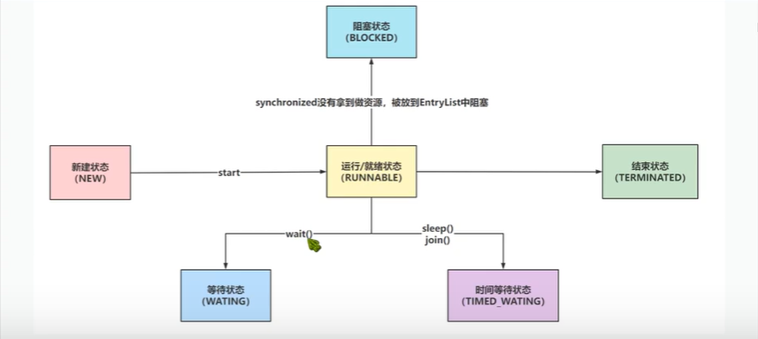

### java中线程

#### java线程实现的几种方式

+ 1.继承Thread类，重写Run方法

```java
package com.yn._01Thread;

class MyThread extends  Thread{
   static int i=100;//共享数据（同一个类的不同对象可共用）
    public void run(){
        while (i>0){
            System.out.println("卖票：剩下："+i);
            i--;
        }
    }

}
public class _01Thread {
    public static void main(String[] args) {
        MyThread myThread1 = new MyThread();
        MyThread myThread2 = new MyThread();
        MyThread myThread3 = new MyThread();
        myThread1.start();
        myThread2.start();
        myThread3.start();
    }
}

```


+ 2.实现Runnable,重写run方法

```java
package com.yn._01Thread;

class MyThread2 implements Runnable{

    static int i=100;
    @Override
    public void run() {
    while (i>0){
        System.out.println("还剩："+i);
        i--;
    }
    }
}

public class _02Thread {
    public static void main(String[] args) {
        MyThread2 myT21=new MyThread2();
        Thread t1 = new Thread(myT21);
        Thread t2 = new Thread(myT21);
        Thread t3 = new Thread(myT21);
        t1.start();
        t2.start();
        t3.start();


    }
}
```


+ 3.实现Callable ,重写call方法,配合FutureTask(一般用于有返回值的类型)
+ 4.实现线程池的方法

本质底层都是Runnable


#### java中线程的状态(6种)




#### java中如何停止线程

+ 1.   stop方法  强制线程结束,无论在干什么,不建议使用

  ```java
  package com.yn.student.test;
  class MyThread extends Thread{
      @Override
      public void run(){
          try {
              Thread.sleep(5000);
          } catch (InterruptedException e) {
              e.printStackTrace();
          }
  
          for(int i=0 ; i<100 ; i++) {
              if(i%2==0) {
                  System.out.println(i);
              }
          }
      }
  }
  public class test1 {
      public static void main(String[] args) {
  
          MyThread myThread = new MyThread();
          myThread.start();
  
          try {
              Thread.sleep(500);
          } catch (InterruptedException e) {
              e.printStackTrace();
          }
          myThread.stop();
          System.out.println(myThread.getState());
      }
  }
  ```

+ 2.通过共享变量来终止

+ 3.通过interrupt来进行停止


#### java中的sleep和wait

区别

+ sleep属于Thread类中的static方法，wait属于Objct方法
+ sleep属于TIMED_WAITING,自动被唤醒，wait属于WAITING，需要手动唤醒
+ sleep方法在持有锁时，执行，不会释放资源，wait在执行后会释放资源
+ sleep可以在持有锁或者不持有锁时，执行，wait方法必须只有锁时才可以执行
+ wait方法会将持有锁的线程从owner扔到WaitSet集合中，这个操作是修改ObjectMonitor对象，如果没有持有synchrnized锁的话是无法操作ObjectMonitor对象的。


#### 并发编程的三大特性

+ 1.原子性
+ 2.可见性
+ 3.有序性

##### 什么是并发编程的原子性

定义： 原子性指一个操作是不可分割的，不可中断的，一个线程在运行时另一个线程不会影响到他

保证并发编程的原子性：

+ synchronized
+ + 可在方法追加synchronized关键字或采用同步代码块的形式来保证原子性
  + synchronized可以避免多线程同时操作临界资源，同一时间只会有一个线程正在操作临界资源
+ CAS
+ + compare and swap 也就是比较和交换，他是一条cpu的并发原语
  + 他在替换内存的某个位置时，首先查看内存中的值与预期值是否一致，如果一致，执行替换操作
+ lock


##### 什么是并发的可见性

可见性问题是基于CPu位置出现的，CPU处理的速度非常快，相对CPU来说去内存获取数据这个事情太慢了

CPU提供了L1，L2,L3的三级缓存，每次去主内存拿完数据后就会存储到CPU的三级缓存，每次从三级缓存中拿数据效率肯定会提升。

但是现在CPU都是多核，每个线程的工作内存（CPU的三级缓存）都是独立的，会告知每个

线程中做修改时，只改自己的工作内存，没有及时的同步到主内存，导致数据不一致的问题。

保证可见性的方法：

+ 1.volatile
+ + volatile是一个关键字，用来修饰成员变量
  + 如果属性被volatile修饰，相当于CPU，对当前属性的操作，不允许使用CPU的缓存，必须去和主内存操作。