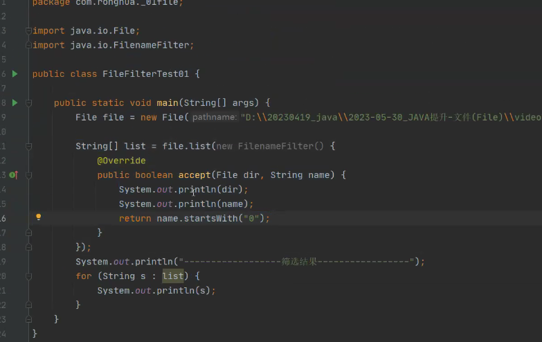

### File

创建文件方法

```java
public class _01Filetest {
    public static void main(String[] args) {

        String path="D:\\test\\test11.txt";

        File file = new File(path);
        try {
           boolean result= file.createNewFile();// 创建文件
            System.out.println(result);
        } catch (IOException e) {
            e.printStackTrace();
        }
    }
}
```


#### 创建文件夹方法

```java
file.mkdir();//单级目录创建
```

如果没有这个文件夹就会创建

如果已经存在则会返回false

如果路径不合法返回false

只会创建给定目录的 末级路径，

```java
file.mkdirs();//多级目录创建
```

如果没有这个文件夹就会创建

如果已经存在则会返回false

如果路径不合法返回false

可以创建多级目录，不会报错，即使路径不存在也会创建


#### 删除文件、文件夹

```java
file.delete();//
```

删除文件（暴力删除） 回收站里面找不到，恢复不了

重复删除返回false

可以删除文件，和文件夹（文件夹必须是空文件夹）


#### File中的判断方法

```java
 String path="D:\\test\\test11.txt";

        File file = new File(path);

        boolean isdirectory = file.isDirectory();//判断是否 是文件夹
        System.out.println(isdirectory);

        boolean isfile = file.isFile();
        System.out.println(isfile);// 判断是否是文件

        boolean exists = file.exists();//判断文件或者是文件夹是否存在
        System.out.println(exists);
```


#### 其他方法

```java
File[] files = File.listRoots();//显示根目录
for (File file1 : files) {
    System.out.println(file1);
}
```


```java
String[] list = file.list();//返回当前文件夹下一层所有文件夹和文件信息
```


#### 删除文件夹功能

```java
//删除目录功能
public static Boolean delete(File file){
    //1.判断文件是否存在
    if (!file.exists()){
        //不存在则退出
        return false;
    }
    //2.判断file是否是文件还是文件夹
    if (file.isFile()){
        //如果是文件则直接删除
        file.delete();
    }else {//是文件夹
        //展示文件夹里面的东西
        File[] files = file.listFiles();// 返回文件对象
        for (File file1 : files) {
            //递归调用
            delete(file1);
        }
        //删除外层空白文件夹
        file.delete();
    }
return true;
}
```


### 文件和文件名过滤器




#### 查找文件夹下指定的文件

```java
public static Boolean findVoid1(File file) {
    //递归找视频文件
    //判断file是文件夹还是文件
    System.out.println(file);    //打印根路径
    File[] files = file.listFiles();//列出所有文件

    for (File file1 : files) {//遍历所有
        if (file1.isFile() && file1.getName().endsWith(".MP4")) {//如果是文件并且是以MP4结尾
            System.out.println(file1.getName());

        } else if (file1.isDirectory()){
            findVoid1(file1);

        }
    }
    return true;
}
```